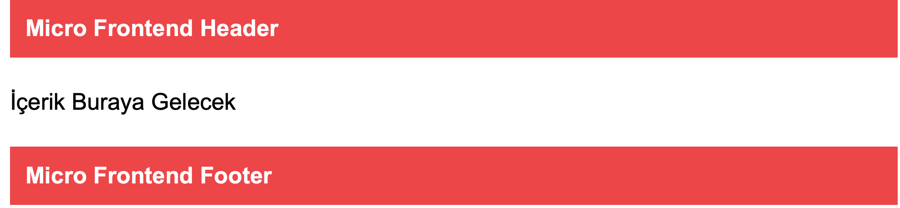
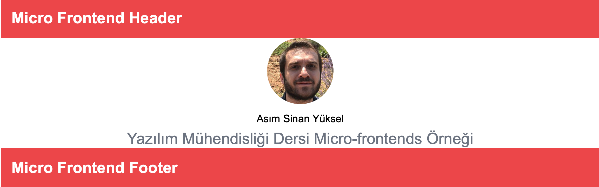

# Micro-frontends Örneği
* Bu proje ReactJS ile basit bir micro-frontends örneğini içermektedir. İçerik [Build a micro-frontend application with React](https://blog.logrocket.com/build-micro-frontend-application-react/) adresindeki yazıda anlatılan adımlar uygulanarak üretilmiştir.
* Microfrontend uygulamaları `npx create-mf-app` komutuyla oluşturulmuştur.
* Projede home ve about micro-frontend uygulamaları yer almaktadır. about, home microfrontend uygulamasında yer alan Header ve Footer bileşenlerine Webpack Module Federation aracılığı ile erişmektedir.
* home micro-frontend uygulaması [localhost:3000](http://localhost:3000) adresinde; about micro-frontend uygulaması [localhost:3001](http://localhost:3001) adresinde çalışmaktadır.

# Uygulamayı çalıştırma
Uygulama klasörü içindeyken 2 ayrı terminal penceresi açılır. 
1. İlk terminalde home klasörüne `cd home` komutu ile girilir `np install & npm start` komutu çalıştırılır.
1. İkinci terminalde about klasörüne `cd about` komutu ile girilir `npm install & npm start` komutu çalıştırılır.

# Ekran Görüntüleri

**home penceresi**

**about penceresi**

